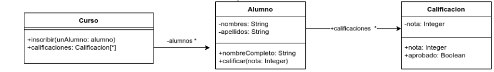

# Enunciado

Dado el siguiente diagrama de clases



Implementar el siguiente método (y lo que se considere necesario):

Curso>>porcentajeAprobados

que retorna el porcentaje de alumnos que aprobaron todas las calificaciones.


Asuma que lo que se provee en el diagrama de clases ya está implementado.

# Solución

```smalltalk
"Selecciono los alumnos que tienen el curso aprobado, con el tamaño de esa colección calculo el porcentaje de aprobados "
Curso>>porcentajeAprobados
|aprobados|
aprobados:= alumnos select: [:each | each cursoAprobado]
^ (aprobados size* 100 / alumnos size)
_______________________________________________________________________
"Devuelve true si todas las calificaciones estan aprobadas"

Alumno>> cursoAprobado
^calificaciones allSatisfy:[:each | each aprobado]

_________________________________________________________________________
```

# Corrección

La solución es correcta; como sugerencia, se podría haber definido un mensaje que devuelva los alumnos que aprobaron el curso.


Corrigió: Agustín Ortu