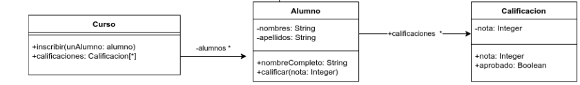

# Enunciado

Dado el siguiente diagrama de clases



implemente el siguiente método (y lo que se considere necesario) :

`Curso>>mejorPromedio`

que retorna el alumno con el mejor promedio de calificaciones.

Asuma que lo que se indica en el diagrama de UML ya está programado.

# Solución

```smalltalk
Curso>>mejorPromedio
| maxPromedio mejorAlumno |
    maxPromedio :=0.
    mejorAlumno := Alumno new.
    alumnos do: [ :alumno | alumno calificaciones average: [ :notas | (notas > maxPromedio) ifTrue: [mejorAlumno := alumno ] ] ]
    ^mejorAlumno
```

# Corrección

La solución es incorrecta, los errores son los siguientes:

1. El mensaje #do no es el más adecuado, dado que ya hay mensajes más especializdos que resuelven la problemática; el uso de #do es reinventar la rueda y resulta en un código procedural. El mensaje más apropiado es #detectMax. Otra solución viable también es ordenar la colección y luego obtener el primer (o último elemento)
2. No es necesario la inicialización de la variable "mejorAlumno", que crea un alumno "vacio" y que no fue inicializado correctamente; en el caso de que el curso no tenga ningún alumno, esta solución devuelve dicho objeto, lo cual no es correcto. Debido a que el enunciado no especifica el comportamiento, lo más adecuado es devolver nil, ya que como no hay ningún alumno, el alumno con el mejor promedio tampoco existe
3. Se rompe encapsulamiento debido a que Curso calcula el promedio de las notas del alumno; debería delegar en la clase Alumno, agregando un mensaje, "Alumno>>promedio" o un nombre similar

Corrigió: Agustín Ortu