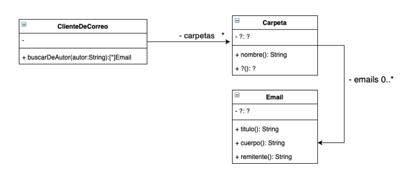

# Enunciado

El diagrama de clases de UML que se muestra a continuación documenta parte del diseño simplificado de un cliente de correo electrónico.




mplemente el siguiente método de la clase ClienteDeCorreo:

#buscarDeAutor(autor:String)

que retorna todos los emails (considerando todas las carpetas) cuyo remitente (quien escribió ese email) es el igual al autor recibido por parámetro.


Asuma que todas las clases poseen sus constructores implementados, y que los métodos nombrados en las clases Carpeta e Email del diagrama de UML ya están implementados. Debe agregar los métodos que considere necesario en las diferentes clases para una buena implementación del método #buscarDeAutor(autor:String).

# Solución

```smalltalk
buscarDeAutor(autor:String)
    ^ carpetas do: [ :carpeta | carpeta emails select: [: email | ( email remitente == autor) ] ]
```

# Corrección

La solución es incorrecta, los errores son los siguientes:

1. El mensaje #do no es el más adecuado, dado que ya hay mensajes más especializados que resuelven la problemática; el uso de #do es reinventar la rueda y resulta en un código procedural.
Además, tener en cuenta que el #do devuelve el objeto receptor del mensaje, en este caso, la colección de carpetas del ClienteDeCorreo. Los mensajes adecuados para resolver el ejercicio involucra el uso de: #collect, #flatten, #flatCollect o similares.
2. Se rompe encapsulamiento, se debería delegar a cada Carpeta el filtrado de los mails
3. Repasar la diferencia de comparar usando identidad (#==) e igualdad (#=). En general, lo más adecuado es utilizar igualdad. Identidad es igualdad a nivel de punteros

Corrigió: Agustín Ortu