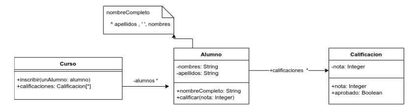

# Enunciado

Dado el siguiente diagrama de clases



implemente el siguiente método (y lo que se considere necesario) :

Curso>>alumnosOrdenAlfabetico

que debe retornar una colección con los alumnos inscriptos en el curso, ordenados alfabéticamente por nombre completo.

Asuma que lo que aparece en el diagrama de UML ya está implementado.

# Solución

```smalltalk
Curso>>alumnosOrdenAlfabetico
    ^ alumnos asSortedCollection sortBlock: [:alumno1 :alumno2 | alumno1 nombreCompleto< alumno2 nombreCompleto]
```

# Corrección

La solución es correcta, un únnico detalle menor es que no hace falta el mensaje #sortBlock, dado que el mensaje #asSortedCollection está definido asi:

Collection>>asSortedCollection: aSortBlock

Por lo tanto, directamente quedaría:

Curso>>alumnosOrdenAlfabetico
    ^ alumnos asSortedCollection: [:alumno1 :alumno2 | alumno1 nombreCompleto< alumno2 nombreCompleto]

Corrigió: Agustín Ortu