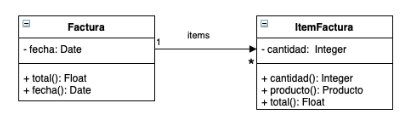

# Enunciado



Escriba los métodos necesarios para poder crear e inicializar una instancia de la clase Factura de forma adecuada. Una vez creada la instancia de Factura, no pueden agregarse items ni cambiarse la fecha, siendo esta la del dia en la que se crea dicha instancia.

# Solución

```smalltalk
Factura class>>newConItems:itemsDeLaFactura
^self new initializeConFecha:(Date today) eItems:itemsDeLaFactura.

Factura>>initializeConFecha:fechaFactura eItems:itemsDeLaFactura
fecha:=fechaFactura .
items:=itemsDeLaFactura.
```

# Corrección

La solución es correcta

Corrigió: Agustín Ortu