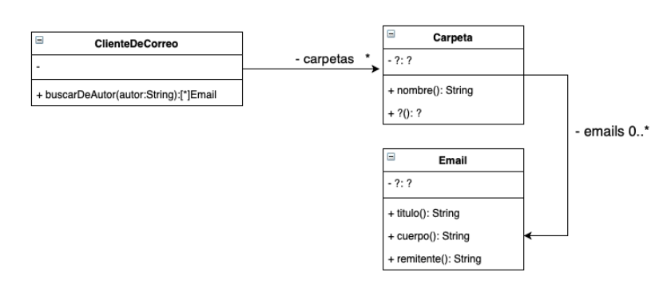

# Enunciado

El diagrama de clases de UML que se muestra a continuación documenta parte del diseño simplificado de un cliente de correo electrónico.



Implemente el siguiente método de la clase ClienteDeCorreo:

#buscarDeAutor(autor:String)

que retorna todos los emails (considerando todas las carpetas) cuyo remitente (quien escribió ese email) es el igual al autor recibido por parámetro.


Asuma que todas las clases poseen sus constructores implementados, y que los métodos nombrados en las clases Carpeta e Email del diagrama de UML ya están implementados. Debe agregar los métodos que considere necesario en las diferentes clases para una buena implementación del método #buscarDeAutor(autor:String).

# Solución

```smalltalk
ClienteDeCorreo >>buscar: unAutor
    carpetas
        detect: [ :carpeta | ^ carpeta buscar: unAutor ]
        ifFound: [ :carpeta | ^ carpeta buscar: unAutor ]
        ifNone: [ ^ nil ]

Carpeta >>buscar: unAutor
    ^ emails
        detect: [ :email | email contiene: unAutor ]
        ifFound: [ :email | ^ email ]
        ifNone: [ ^ false ]

Email >>contiene: unAutor
    ^ unAutor match: autor
```

# Corrección

1. El nombre del mensaje es #buscarDeAutor: autor
2. La solución no es correcta porque debemos retornar una colección de emails, todos aquellos que fueron enviados por el autor que se recibe como parámeto. La implementación está devolviendo un único mail

Una posible solución correcta, sería:

ClienteDeCorreo>>buscarDeAutor: autor
  ^ carpetas flatCollect: [:carpeta | carpeta mailsDe: autor ]

Carpeta>>mailsDe: autor
  ^ emails select: [:email | email enviadoPor: autor ]

Email>>enviadoPor: autor
  ^ remitente = autor

Corrigió: Agustín Ortu