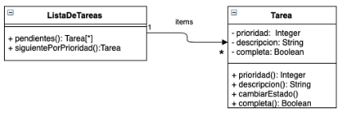

# Enunciado

 Dado el siguiente diagrama, implemente la clase ListaDeTareas incluyendo lo necesario para su instanciación e inicialización, y los métodos

#pendientes  que retorna la colección de tareas que estén incompletas.

#siguientePorPrioridad que retorna la tarea incompleta de mayor prioridad (si hay mas de una con la prioridad más alta retorna cualquiera de ellas, si no hay tareas retorna nil).

Asuma que la clase Tarea ya está implementada.


# Solución

```smalltalk
Object subclass: #ListaDeTareas
v.i: tareas

ListaDeTareas>> initialize
    tareas := OrderedCollection new


ListaDeTareas>> agregarTarea: unaTarea
    tareas add: unaTarea


ListaDeTareas>> pendientes
    ^ self tareas reject: [ :tarea | tarea completa ]


ListaDeTareas>> siguientePorPrioridad
    | tareasOrdenadas |
    tareasOrdenadas := self pendientes asSortedCollection: [ :a :b | a prioridad > b prioridad ].
    tareasOrdenadas isEmpty
        ifTrue: [ ^ nil ]
        ifFalse: [ ^ tareasOrdenadas first ]
```

# Corrección

La solución es correcta

Unos comentarios

1. #pendientes hace self tareas, pero no se definió el mensaje #tareas. Se debería haber usando la v.i, ó bien, definir el mensaje
2. Se podría aprovechar instanciar una SortedCollection, en lugar de una OrderedCollection, para que siempre se mantenga el orden

Corrigió: Agustín Ortu