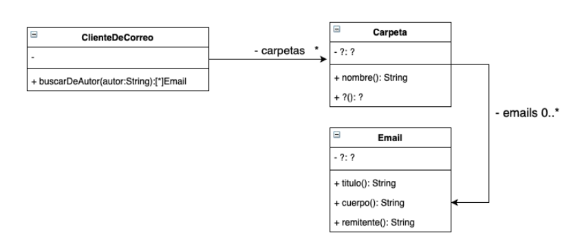

# Enunciado

El diagrama de clases de UML que se muestra a continuación documenta parte del diseño simplificado de un cliente de correo electrónico.




mplemente el siguiente método de la clase ClienteDeCorreo:

#buscarDeAutor(autor:String)

que retorna todos los emails (considerando todas las carpetas) cuyo remitente (quien escribió ese email) es el igual al autor recibido por parámetro.


Asuma que todas las clases poseen sus constructores implementados, y que los métodos nombrados en las clases Carpeta e Email del diagrama de UML ya están implementados. Debe agregar los métodos que considere necesario en las diferentes clases para una buena implementación del método #buscarDeAutor(autor:String).

# Solución

```smalltalk
Object subclass: #ClienteDeCorreo
v.i: coleccionDeCarpetas

>>buscarDeAutor: unAutor

|coleccionDeMailsDelAutor|
coleccionDeMailsDelAutor:= OrderedCollection new

 (self coleccionesDeMail: unAutor)
                   do: [:cadaColeccionDeMail | coleccionDeMailsDelAutor addAll: cadaColeccionDeMail]

^coleccionDeMailsDelAutor


>> coleccionesDeMail: unAutor

^(coleccionDeCarpetas select:[:carpeta | carpeta tieneAutor: unAutor ])
                    collect: [ :cadaCarpeta | cadaCarpeta mailsDelAutor: unAutor]


Object subclass: #Carpeta
vi: coleccionDeMails

>> mailsDelAutor: unAutor

^ coleccionDeMails select: [:mail | mail tieneAutor: unAutor]

>>tieneAutor: unAutor

^ coleccionDeMails detect: [:mail | mail tieneAutor: unAutor]


Object subclass: #Email
v.i.: titulo cuerpo remitente

>> tieneAutor: unAutor

^(unAutor=self remitente)
```

# Corrección

La solucón no es correcta, ya que está devolviendo una colección de los nombres; y se pedia devolver los Alumnos aplicando un criterio de orden.

1. El nombre de la variable de instancia debe ser "carpetas", no "coleccionDeCarpetas"
2. Se debe hacer uso de mensajes de mayor nivel de abstracción. #do lleva a reinventar la rueda y a soluciones procedurales. Por ej en #buscarDeAutor: unAutor, se utiliza #do, cuando se podría haber usado mensajes como #collect + #flattened o #flatCollect
3. Hay algunas cuestiones que hacen que la solución pueda fallar y no están contempladas, por ej: si una carpeta no tiene el autor que se está buscando, el #detect empleado en el mensaje #tieneAutor va a fallar. También, el #detect devuelve el primer objeto que cumple la condición especificada en el bloque; en #coleccionesDeMail: unAutor, se lo utilza dentro de un bloque de #select, que espera una expresión booleana

Una posible solución correcta, sería:

ClienteDeCorreo>>buscarDeAutor: unAutor
  ^ carpetas flatCollect: [:carpeta | carpeta mailsDe: unAutor ]

Carpeta>>mailsDe: unAutor
  ^ emails select: [:email | email enviadoPor: unAutor ]

Email>>enviadoPor: unAutor
  ^ remitente = unAutor


Corrigió: Agustín Ortu