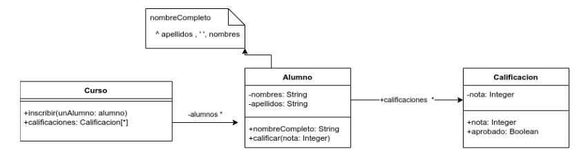

# Enunciado

Dado el siguiente diagrama de clases



implemente el siguiente método (y lo que se considere necesario) :

Curso>>alumnosOrdenAlfabetico

que debe retornar una colección con los alumnos inscriptos en el curso, ordenados alfabéticamente por nombre completo.

Asuma que lo que aparece en el diagrama de UML ya está implementado.

# Solución

```smalltalk
Curso>>alumnosOrdenAlfabetico
    ^ alumnos asSortedCollection sortBlock: [:alumno1 :alumno2 | alumno1 nombreCompleto< alumno2 nombreCompleto]
```

# Corrección

# Solución

```smalltalk
Object subclass: #Curso
v.i: coleccionDeAlumnosInscriptos

>>Inscribir: unAlumno

coleccionDeAlumnosInscriptos add: unAlumno

>>alumnosOrdenAlfabetico

^(self coleccionNombresCompletos) sort: [ :nombre1 :nombre2 | nombre1 < nombre2  ]

>>coleccionNombresCompletos

^ coleccionDeAlumnosInscriptos collect: [:alumno | alumno nombreCompleto]
```

# Corrección

La solucón no es correcta, ya que está devolviendo una colección de los nombres; y se pedia devolver los Alumnos aplicando un criterio de orden.

Algunas variantes correctas:

Curso>>alumnosOrdenAlfabetico
    ^ alumnos asSortedCollection: [:alumno1 :alumno2 | alumno1 nombreComplet o< alumno2 nombreCompleto]


Curso>>alumnosOrdenAlfabetico
    ^ alumnos sorted: [:alumno1 :alumno2 | alumno1 nombreCompleto < alumno2 nombreCompleto]

Corrigió: Agustín Ortu