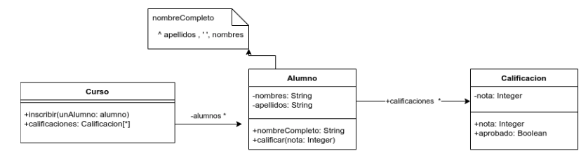

# Enunciado

Dado el siguiente diagrama de clases



implemente el siguiente método (y lo que se considere necesario) :

Curso>>alumnosOrdenAlfabetico

que debe retornar una colección con los alumnos inscriptos en el curso, ordenados alfabéticamente por nombre completo.

Asuma que lo que aparece en el diagrama de UML ya está implementado.

# Solución

```smalltalk
Curso>>alumnosOrdenAlfabetico
    ^alumnos sorted: [ :a :b | a nombreCompleto <= b nombreCompleto ]
```

# Corrección


La solución es correcta

Corrigió: Agustín Ortu