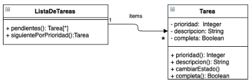

# Enunciado

 Dado el siguiente diagrama, implemente la clase ListaDeTareas incluyendo lo necesario para su instanciación e inicialización, y los métodos

#pendientes  que retorna la colección de tareas que estén incompletas.

#siguientePorPrioridad que retorna la tarea incompleta de mayor prioridad (si hay mas de una con la prioridad más alta retorna cualquiera de ellas, si no hay tareas retorna nil).

Asuma que la clase Tarea ya está implementada.


# Solución

```smalltalk
Object subclass: # ListaDeTareas
v.i: items

ListaDeTareas >> pendientes
  "retorna una coleccion de tareas que esten incompletas"
  ^ items select: [actual | actual completa not] ifNone: [^ nil]. "si devuelve true es completa, me quedo con las que
    devuelvan false"

ListaDeTareas >>siguientePorPrioridad
  "retorno la tarea incompleta de mayor prioridad"
  self pendientes ifNil: [^ nil] ifNotNil: [^ self calculoDeMayorPrio]

ListaDeTareas >> calculoDeMayorPrio
  "retorno el calculo de mayor prioridad
  |tareaM prioM|
  prioM:= 0.
  self pendientes do: [ actual | actual prioridad > prioM ifTrue: [ tareaM := actual. prioM := actual prioridad] ]
  ^ tareaM.
```

# Corrección

1. La clase no tiene metodo de creación y/o inicialización

3. El metodo ListaDeTareas>>pendientes hace uso de #select: ifNone: que es un mensaje que no existe en el protocolo de colecciones. De todos modos, si no hay tareas completas, en lugar de devolver nil, es preferible devolver una colección vacía, para que los clientes de este mensaje siempre tengan un objeto con el que trabajar y no tengan que chequear por nil. Adicionalmente, en este caso, es aconsejable utilizar #reject: que es basicamente lo mismo que #select, pero se queda con los elementos que evaluan a falso:

ListaDeTareas>>pendientes
  ^ items reject: [actual | actual completa ]

3. ListaDeTareas>>calculoDeMayorPrio reinventa la rueda, ya que hace uso de #do. Debería ordenar la colección y luego obtener el primer elemento:

ListaDeTareas>>siguientePorPrioridad
    tareasOrdenadas := self pendientes asSortedCollection: [ :a :b | a prioridad > b prioridad ].
    tareasOrdenadas isEmpty
        ifTrue: [ ^ nil ]
        ifFalse: [ ^ tareasOrdenadas first ]

Otra opción correcta en este contexto es intanciar una SortedCollection, para que mantenga siempre la propiedad de orden

Corrigió: Agustín Ortu